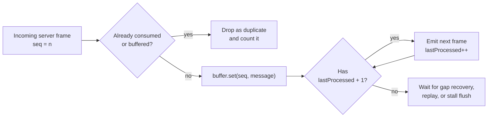
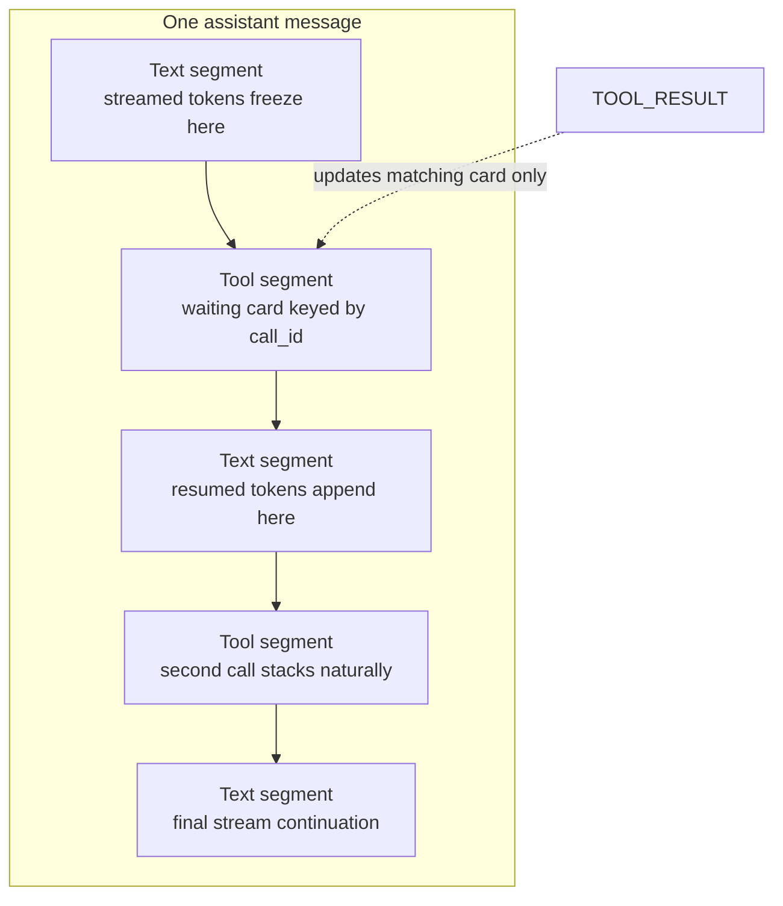
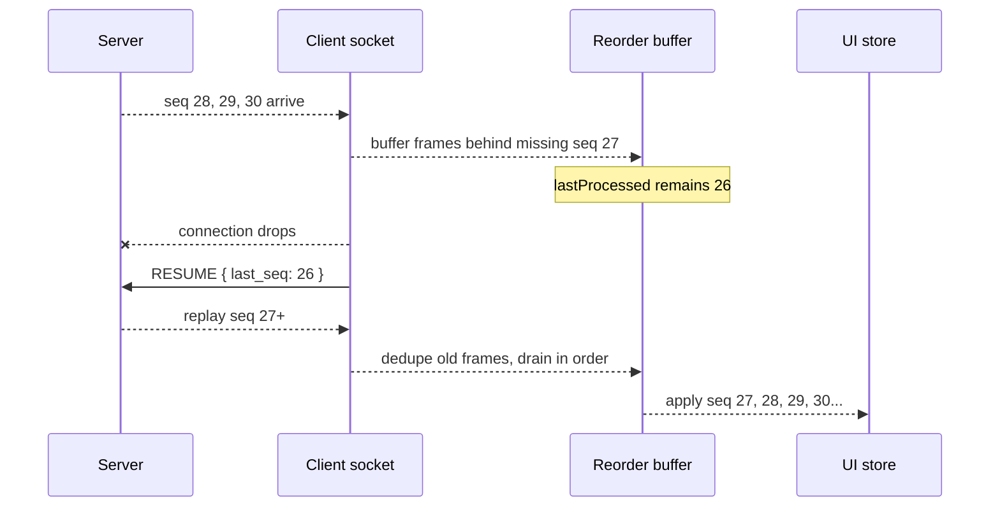
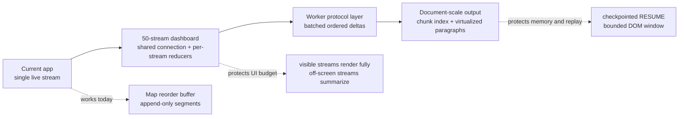

# DECISIONS

## 1. Seq ordering and deduplication

**Data structure:** a `Map<seq, message>` plus a single `lastProcessed` cursor
(`lib/reorderBuffer.ts`).

- A message with `seq <= lastProcessed`, or whose `seq` is already held, is a duplicate
  → dropped and counted.
- Otherwise it is inserted, then we *drain*: walk `lastProcessed + 1, +2, …` while the
  map contains the next seq, emitting strictly in order.

Why a Map and not a min-heap or sorted array: the server's chaos reorder window is 4
messages, so the buffer holds a handful of entries at most; `O(1)` insert/lookup with a
sequential drain beats heap bookkeeping at this scale, and the *invariant* is what
matters — everything at or below `lastProcessed` has been handed to the consumer
exactly once. The same invariant is what makes `RESUME` trivial: `last_seq` is just
`lastProcessed`, and replayed events go through the same buffer, so replay duplicates
are dropped by the same code path that handles chaos duplicates. No special cases.

Two deliberate escape hatches:

- **Deadline beats order for protocol replies.** `PING` is answered at receive time
  (the 3s deadline can't wait on a gap), and a `TOOL_CALL` held behind a gap >1.2s is
  ACKed early (2s deadline) while its *rendering* still waits for order.
- **Stall flush.** If a gap survives 12s (should be impossible: the server flushes its
  reorder buffer at stream end, and drops are healed by RESUME), we force-flush in seq
  order, advance the cursor, and log a loud warning — a stuck UI is worse than a
  documented gap.

The server resets `seq` to 0 on every `USER_MESSAGE` (it clears history per turn), so
the buffer resets on send. Missing that detail makes every second turn look like one
giant duplicate burst.

## 2. Preventing layout shift during tool-call interruptions

The fix is in the data model, not CSS: an assistant message is an **append-only list of
segments** — `text | tool | text | tool | text…`. A `TOOL_CALL` closes the current text
segment and appends a tool segment; resumed tokens append a *new* text segment. Nothing
that is already rendered is ever rewritten, so the frozen text physically cannot
reflow, and rapid sequential tool calls stack naturally (two `TOOL_CALL`s before any
result = two awaiting cards, results matched by `call_id`).

CSS supports this with three details:

- `contain: content` on the message bubble, so streaming appends never invalidate
  layout outside the bubble;
- the tool card's result area has a reserved `min-height` with a shimmer placeholder,
  so `TOOL_RESULT` landing doesn't push the text below it;
- text segments are `white-space: pre-wrap` spans keyed by stable ids — React appends
  to one text node rather than re-creating siblings.

Token appends mutate the store and notifications are coalesced per animation frame, so
the renderer sees at most 60 updates/sec regardless of socket burst rate.

## 3. Reconnection state recovery: "consumed" vs "received"

Two counters with different owners:

- **Received** is implicit — whatever the socket delivered, including things still
  sitting in the reorder buffer behind a gap.
- **Consumed** is `ReorderBuffer.lastProcessed`, which only advances when a message has
  been applied to the store *in order*. That is what `RESUME { last_seq }` reports.

This distinction is the whole game: if we reported the highest seq *received* (say 30,
with 27 missing), the server would replay nothing after 30 and seq 27 would be lost
forever. By reporting the highest *contiguously consumed* seq, the replay re-delivers
anything we had only partially seen, and the dedup path silently discards what we
already applied. Stitching is therefore free — replayed events flow through the
identical apply path, appending to the same segment model with no visible jump.

A tool card whose `TOOL_RESULT` was lost in the drop simply stays in its shimmer
"waiting" state; the replayed `TOOL_RESULT` (seq > last_seq) finds the card by
`call_id` and completes it.

Two watchdogs back this up: a **dead-socket** timer (heartbeats arrive every 12s, so
35s of silence on an "open" socket forces a reconnect — chaos drops use `terminate()`
with no close frame) and an **interrupted-stream** timer (see §5, failure modes).

## 4. If this had to show 50 concurrent agent streams

- **One shared connection manager, N stream reducers.** The `AgentClient`/buffer layer
  is already stream-agnostic; the store would shard per `stream_id` so one stream's
  burst doesn't invalidate the other 49 panels (per-stream subscription, not one global
  version counter).
- **Rendering budget, not rendering everything.** Off-screen streams downgrade to a
  summary row (last line + status); only visible panels mount their segment lists.
  The trace panel is already windowed; it would gain a per-stream lane filter.
- **Move protocol work off the main thread.** Parse + reorder + dedup in a
  SharedWorker (which also lets 50 dashboard tabs share one socket), posting batched,
  already-ordered deltas to the UI at frame granularity.
- **Backpressure policy.** At 50 × 30 events/sec you must decide what to drop for
  display (e.g., keep token *counts* but only materialise text for focused streams);
  the protocol layer keeps everything, the view layer samples.

## 5. If responses were 100× longer (document generation)

- The append-only segment model holds, but a single text segment becomes megabytes:
  switch the chat panel to **windowed rendering of paragraphs** (the same fixed-height
  virtualisation the trace panel uses, generalised to measured blocks), so DOM size is
  bounded by viewport, not document length.
- **Don't keep the whole transcript in component-visible state.** Older content moves
  to an indexed, immutable chunk list (or IndexedDB for crash recovery); the store only
  notifies for the visible window.
- `RESUME` from seq 0 after a late drop would replay an enormous history: negotiate
  **checkpointing** (server confirms "compacted through seq N") so recovery cost is
  proportional to the loss, not to the document.
- Trace token-grouping already collapses tokens per stream; for documents it would
  also need time-bucketing (one row per ~5s of streaming) to keep the timeline scannable.

## Failure modes in the protocol itself

1. **The TOOL_ACK timeout race.** The server waits 5s for `TOOL_ACK`, then *deletes*
   the pending entry and sends `TOOL_RESULT` anyway. An ACK that arrives at t=5.01s —
   perfectly compliant from a client that ACKed within its 2s window measured from
   *receipt* (the message may have spent 8s in a chaos latency spike or behind a seq
   gap) — is logged as `"unexpected"`. The deadline is measured against *send time*,
   the client can only act on *receive time*, and the wire is allowed to be slower than
   the deadline. The same race fires on replay: a reconnecting client must ACK replayed
   `TOOL_CALL`s it never ACKed (it can't know whether the original ACK landed), but the
   new connection has no pending entry, so a correct client is again logged
   "unexpected". An ACK protocol over a lossy ordered channel needs either
   server-side idempotent ACK acceptance or ACK-with-seq so the server can
   distinguish "late" from "wrong".

   **The unwinnable variant (observable in `/log`):** in chaos mode the *server's own*
   reorder buffer can hold the `TOOL_CALL` — the 5s ACK timer starts at
   `waitForAck()`, but the frame may not have been put on the wire at all (it sits in
   the chaos `reorderBuffer` until 4 messages accumulate, and the server sends nothing
   further while waiting for the ACK, so the buffer may only flush at timeout). The
   resulting `TOOL_ACK_TIMEOUT` violation followed by an `"unexpected"` late ACK is
   produced by the server racing itself; no client behaviour can prevent it. If a
   chaos-mode `/log` shows exactly this pair, that is the signature.

2. **Aborted scripts are never resumed.** On reconnect the server replays history but
   explicitly does not continue the aborted script (`handleResume` comment), so a
   stream that died mid-flight will never receive `STREAM_END` — and the dropped-then-
   replayed history ends at the drop point. A client that trusts the protocol spins on
   "streaming" forever. This console detects 15s of no stream progress (excluding
   heartbeats, which would otherwise keep resetting the timer every 12s) and marks the
   message **interrupted**, visibly and honestly.

3. **PING replay on RESUME.** Heartbeat PINGs are recorded in the event history, so a
   resume replays stale PINGs whose challenges the server no longer tracks. Answering
   each one floods the log with `"unexpected"` PONGs; answering none risks missing a
   real PING interleaved in the burst. The console debounces 40ms and answers only the
   newest challenge.

4. **`/health` vs single-session truth.** The server is single-session and silently
   closes the previous socket on a new connection ("replaced"). Two open tabs will
   fight each other with no protocol-level signal — worth knowing before demoing.

## What was attempted and known limitations

- Everything in Tasks 1–4 is implemented and verified against the live server: unit
  tests for the buffer and diff engine, a normal-mode e2e suite that asserts `/log`
  contains zero violations and ACKs are `ok`, and a chaos-mode e2e suite that verifies
  the UI reaches a coherent terminal state while preserving PONG correctness.
- The 500KB snapshot renders via lazy tree expansion and a node-budgeted diff; the diff
  marks itself "truncated" beyond 60k nodes rather than freezing the tab. A worker
  thread would be the next step, not a different algorithm.
- Trace rows use fixed-height windowing; row expansion is a pinned detail pane instead
  of inline accordions — a deliberate trade so virtualisation stays O(viewport).
