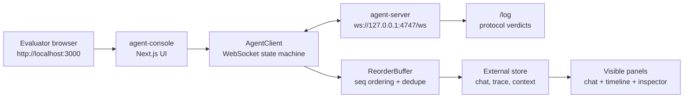

# Agent Console — Full Stack AI Submission

Next.js **Agent Console** connected to the provided mock **agent-server** over WebSockets: streaming tokens, mid-stream tool calls, live trace timeline, context inspector, and chaos-mode recovery.

## Repository layout

```
agent-console/   ← your implementation (Next.js frontend)
agent-server/    ← provided mock backend (do not modify)
ASSIGNMENT.md    ← original Alchemyst assignment brief + protocol reference
```

The chaos-mode recording is included at
[`agent-console/docs/chaos-recording.mp4`](./agent-console/docs/chaos-recording.mp4).

## System at a glance



## For evaluators — copy commands from ASSIGNMENT.md

These match the commands in [ASSIGNMENT.md](./ASSIGNMENT.md) exactly. All were verified to work from this repo.

**Prerequisite:** Docker running (Docker Desktop, or `colima start` on Mac), **or** use the no-Docker path below.

### 1. Start the mock agent backend (ASSIGNMENT.md § The Agent Server)

From the **repo root**:

```bash
docker build -t agent-server ./agent-server
docker run -p 4747:4747 agent-server            # normal mode
docker run -p 4747:4747 agent-server --mode chaos  # chaos mode (stop normal container first)
```

Or the appendix variant:

```bash
cd agent-server
docker build -t agent-server .
docker run -p 4747:4747 agent-server
```

Verify: `curl http://localhost:4747/health`

**No Docker:** `npm run server:start` (normal) or `npm run server:start:chaos` (chaos).

### 2. Build and run the Next.js app (ASSIGNMENT.md deliverable)

In a **second terminal**, from the **repo root**:

```bash
npm install && npm run build && npm run start
```

Open **http://localhost:3000** in your browser (not `ws://localhost:4747/ws` — that URL is internal to the app).

**Use one browser tab only.** The agent-server accepts a single WebSocket client; multiple tabs cause a reconnect loop.

**After `npm run build`, restart the frontend** (stop the old `npm run start` process first) and hard-refresh the browser (`Cmd+Shift+R`). Otherwise Send may not work — the page JS can fail to load.

The app connects to the backend at `ws://127.0.0.1:4747/ws`. You should see a green **Connected** badge.

### 3. Verify protocol compliance (evaluation criteria)

After using the app, check server-side logs:

```bash
curl -s http://localhost:4747/log | python3 -m json.tool
```

Look for `"verdict": "ok"` on PONG, TOOL_ACK, and RESUME entries.

### 4. Run tests (optional)

Backend must be running on port 4747:

```bash
npm test                      # unit tests (21 tests)
npm run test:e2e:normal       # protocol compliance
npm run test:e2e:reconnect    # RESUME / replay
npm run test:e2e:chaos        # chaos survival (server in chaos mode)
```

### One-command Docker stack (alternative)

Runs backend + frontend together:

```bash
npm install
npm run docker:up      # normal mode → http://localhost:3000
npm run docker:chaos   # chaos mode
```

---

## Architecture & docs

| Doc | Contents |
| --- | --- |
| [agent-console/README.md](./agent-console/README.md) | Architecture, state machine diagram, verification matrix, screenshots |
| [agent-console/DECISIONS.md](./agent-console/DECISIONS.md) | Design rationale (required deliverable) |
| [agent-server/README.md](./agent-server/README.md) | Backend endpoints, trigger keywords |
| [ASSIGNMENT.md](./ASSIGNMENT.md) | Original brief + full protocol reference |
