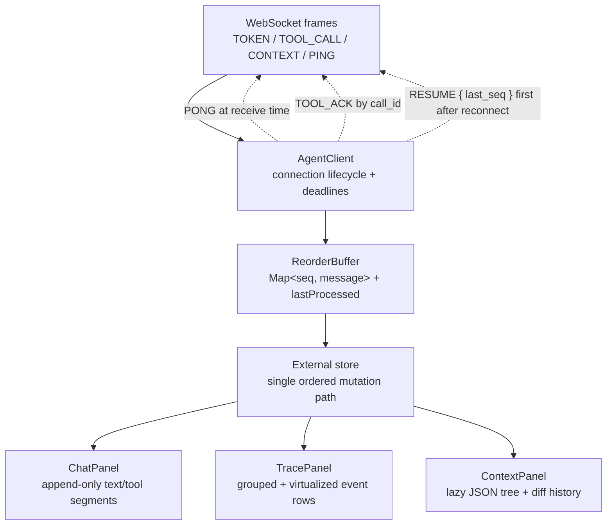
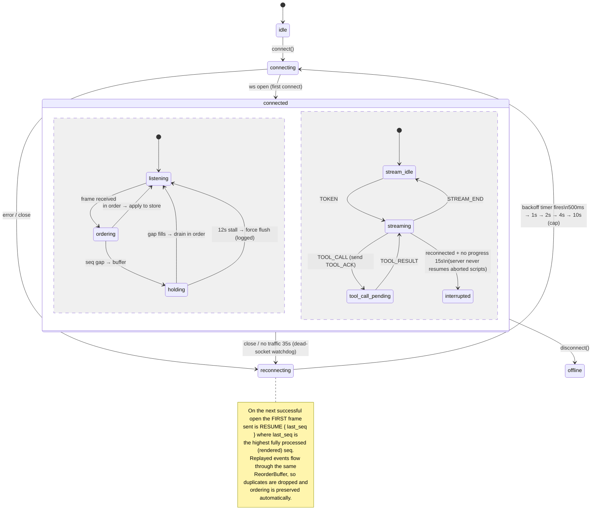
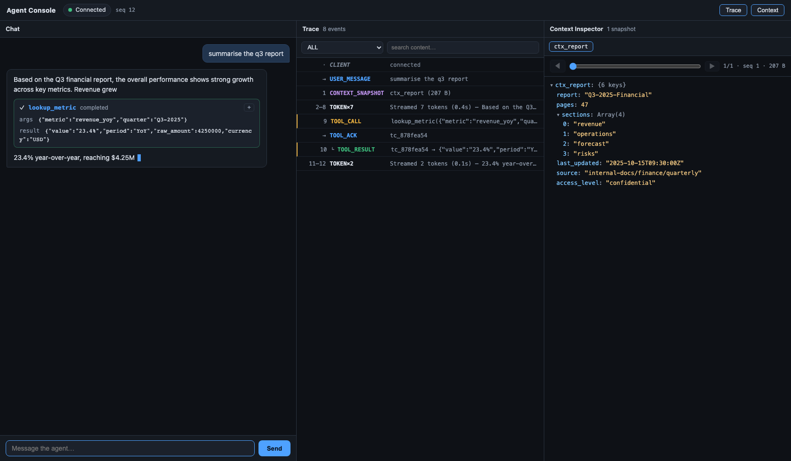
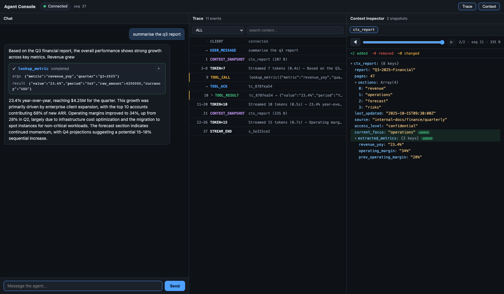
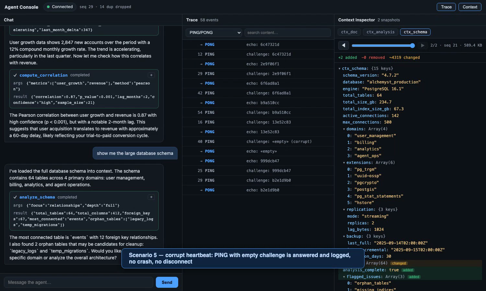

# Agent Console

A Next.js (App Router) console for a streaming AI agent over WebSockets: token-by-token
rendering with mid-stream tool-call interruptions, a live protocol trace timeline, a
context inspector with structural diffs, and connection recovery that survives the
agent-server's chaos mode.

## Architectural approach (summary)

Protocol handling and rendering are fully separated: a framework-free `AgentClient`
state machine owns the socket lifecycle (backoff, RESUME, PONG, TOOL_ACK) and feeds
every frame through a pure `ReorderBuffer` that emits messages strictly in `seq` order
with duplicates dropped. Ordered messages mutate a single external store whose React
notifications are coalesced onto animation frames, so 30+ events/sec cost one render
per frame; the chat model is an append-only list of segments (text / tool), which makes
tool-call interruptions a data-structure property rather than a rendering trick.



## Connection state machine



Independent of connection state, every received `PING` is answered at *receive time*
(debounced 40ms so a burst of replayed PINGs yields one PONG for the newest challenge) —
the 3-second PONG deadline must not wait for a seq gap to fill. Likewise a `TOOL_CALL`
stuck behind a gap for >1.2s is ACKed early so the 2-second ACK deadline is met, while
its rendering still waits for correct order.

## Running

From the repository root:

```bash
npm install
npm run build
npm run start          # http://localhost:3000
```

Docker Compose from the repository root runs both the mock backend and this app:

```bash
npm run docker:up      # normal backend mode
npm run docker:chaos   # chaos backend mode
```

Local backend + frontend without Docker (from the repository root):

```bash
# terminal 1
npm run server:start
# chaos mode:
npm run server:start:chaos

# terminal 2
npm run build
npm run start          # http://localhost:3000
```

No env vars required (defaults to `ws://127.0.0.1:4747/ws`; override with
`NEXT_PUBLIC_AGENT_WS_URL`). Open **http://localhost:3000** in the browser — do not
navigate to the WebSocket URL directly.

```bash
npm test                                   # unit tests: reorder buffer + diff engine
npm run test:e2e:normal                    # live protocol compliance (server in normal mode)
npm run test:e2e:reconnect                 # deterministic reconnect/replay test
npm run test:e2e:chaos                     # live chaos survival (server in chaos mode)
```

## Verification matrix

| Assignment requirement | Evidence |
|---|---|
| Smooth token streaming and mid-stream tool-call rendering | `npm test`; `npm run test:e2e:normal`; screenshot `docs/01-streaming-tool-call.png` |
| Reorder, duplicate, and replay correctness | `lib/__tests__/reorderBuffer.test.ts`; `npm run test:e2e:reconnect` |
| Context inspector and structural diffs | `lib/__tests__/jsonDiff.test.ts`; screenshot `docs/03-context-diff.png` |
| Protocol trace visibility | screenshot `docs/02-trace-timeline.png`; live `/log` assertions in `e2e/protocol.e2e.test.ts` |
| `TOOL_ACK`, `PONG`, and `RESUME` protocol compliance | `npm run test:e2e:normal`; `npm run test:e2e:reconnect` |
| Chaos-mode survival | `npm run test:e2e:chaos`; included recording at `docs/chaos-recording.mp4` |

The deterministic reconnect test uses an in-process WebSocket server to force the
hard cases directly: `RESUME { last_seq }` must be the first frame on the new
socket, missed events are replayed with duplicates and out-of-order frames, a
tool card is completed after reconnect, and an empty-challenge `PING` receives a
valid `PONG`.

### Chaos-mode log note

The mock backend can drop a socket while it is waiting for a tool ACK. In that
race, `/log` may show `TOOL_ACK_TIMEOUT` followed by a late or `unexpected`
`TOOL_ACK`; that is a backend timing artifact of the chaos harness. The chaos
test treats PONG correctness and missed-PONG termination as hard failures, and
only allows an `interrupted` UI state when `/log` contains an accepted `RESUME`.

## Screenshots (normal mode)

| Streamed response with tool call | Trace timeline | Context inspector diff |
|---|---|---|
|  |  |  |

## Chaos mode recording

See the included MP4 at [`docs/chaos-recording.mp4`](./docs/chaos-recording.mp4)
or the YouTube recording: https://www.youtube.com/watch?v=7L2x-ZRiKEQ.

Final recording checklist:

1. Start the backend in chaos mode and the console frontend.
2. Send `summarise the q3 report`.
3. Send `analyze and compare`.
4. Send `show me the database schema`.
5. Send `write a long detailed document please`.
6. Show the final chat state, trace timeline, context panel, `/log`, and the
   terminal output from the e2e scripts.

## Layout of interesting code

| File | What it is |
|---|---|
| `lib/reorderBuffer.ts` | Pure seq ordering + dedup (unit tested, incl. reversed/duplicate/gap cases) |
| `lib/agentClient.ts` | Connection state machine, heartbeats, RESUME, TOOL_ACK, watchdogs |
| `lib/store.ts` | External store; segment-based chat model; rAF-coalesced notifications |
| `lib/jsonDiff.ts` | Budgeted structural JSON diff (unit tested) |
| `components/TracePanel.tsx` | Windowed (virtualised) timeline, token grouping, filters, linking |
| `components/JsonTree.tsx` | Lazy tree — O(visible nodes) even for 500KB payloads |

State-management rationale, layout-shift strategy, recovery design and scaling notes
are in [`DECISIONS.md`](./DECISIONS.md).
